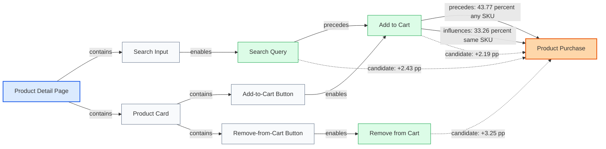

# Causal PM

Causal PM is a research-to-product project for causal product analytics.

The core idea is that product interfaces already encode a directed structure: users encounter pages, DOM nodes, copy, forms, modals, and calls to action in constrained orders. That DOM and interaction structure can be used as a causal prior, then updated with observed behavioral data to help PMs ask and answer causal questions about user journeys.

## Working Hypothesis

Traditional analytics tools are mostly descriptive:

- what users clicked
- where users dropped off
- which funnels performed better
- what correlated with conversion

Causal PM aims to move from descriptive analytics to causal product reasoning:

- which interface element plausibly caused drop-off
- which action has the largest effect on conversion
- what would happen if a modal, step, field, or CTA changed
- which paths are structurally necessary versus merely common

The DOM tree is not treated as truth by itself. It is treated as a product-structure graph that becomes useful when combined with event streams, outcomes, experiments, and causal assumptions.

## First Experimental Finding

We tested the first causal-engine prototype on the RecSys25 Synerise ecommerce event dataset. The prototype compared raw descriptive relationships against adjusted estimates using prior behavior, purchase history, recency, active-client status, and product-property features as confounders.

The clearest early result is `add_to_cart`.

Raw analytics says:

```text
Users who added to cart before the cutoff were less likely to buy later.
```

At 100k sampled clients:

```text
add_to_cart -> later product_buy

naive descriptive difference:      -10.64%
activity-adjusted difference:       -1.15%
propensity-proxy difference:        +1.99%
regression-adjusted difference:     +2.19%
```

The naive read is misleading because add-to-cart is a late-funnel action. Many users who added to cart before the cutoff may have already bought before the later outcome window. Others may differ in lifecycle, intent, prior purchase history, product category, or recency. Once the engine adjusts for observed confounders, the negative relationship weakens or flips positive.

This is the product wedge:

- descriptive analytics says what happened
- causal analytics asks whether the comparison is fair
- product-structure priors help interpret each event by its role in the interface
- the LLM layer can explain the difference to PMs without pretending the estimate is stronger than the evidence

Current evidence level:

```text
adjusted association, not a final causal effect
```

That distinction matters. Causal PM should help a PM move from "add-to-cart users buy less later" to "the raw comparison is confounded; after adjustment, add-to-cart appears weakly positive and should be tested with a tighter event-relative window or experiment."

We then tested the tighter event-relative version:

```text
After add_to_cart at time t, did the same client buy soon after?
```

At 100k sampled clients:

```text
same-SKU purchase after add_to_cart

within 1 hour:   28.94%
within 24 hours: 33.26%
within 7 days:   35.82%

any-SKU purchase after add_to_cart

within 1 hour:   35.07%
within 24 hours: 43.77%
within 7 days:   52.26%
```

This shows why product structure matters. `add_to_cart` is not just another event; it is a late-funnel commitment action. Evaluated against an overly broad future window, it can look negative. Evaluated against the local product journey around the event, it is strongly associated with near-term purchase.

The first graph artifact is available at:

```text
experiments/graphs/synerise_product_journey_v0.json
```

It combines synthetic product-structure priors, event-to-product mappings, adjusted candidate-causal edges, and event-relative timing evidence.



## System Shape

```text
Browser Tracker
  -> Event Ingestion
  -> Session Store
  -> DOM/Product Graph Store
  -> Causal Engine
  -> LLM Query Interface
  -> PM Dashboard
```

## Repository Structure

```text
apps/
  dashboard/             PM-facing UI for querying and visualizing causal graphs

docs/
  00-product-thesis.md   Core thesis and product framing
  01-architecture.md     End-to-end system architecture
  02-causal-model.md     Causal graph assumptions and modeling approach
  03-roadmap.md          Build plan and milestones
  04-dataset-strategy.md How local datasets fit the first prototype

experiments/             Research notebooks, prototypes, and synthetic tests

infra/                   Deployment and local infrastructure config

packages/
  tracker/               Browser-side DOM and interaction capture script

schemas/
  event.schema.json      Canonical event payload shape
  graph.schema.json      Canonical causal/product graph shape

services/
  ingestion/             API/service that receives and normalizes events
  causal-engine/         Graph construction, causal inference, counterfactuals
  llm-interface/         Natural language to causal-query layer
```

## First Build Target

The first useful prototype should answer one constrained question:

> Given a captured DOM snapshot, a sequence of user events, and a conversion outcome, can we produce a causal product graph that lets a PM ask why users drop off at a specific point?

That prototype should use synthetic or local data before trying to become a production analytics platform.
